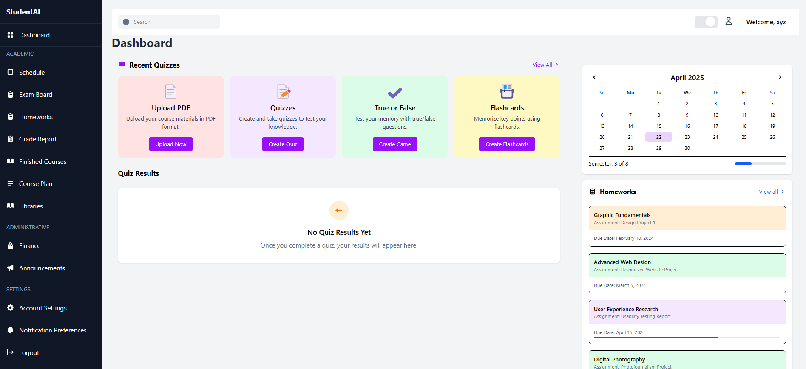
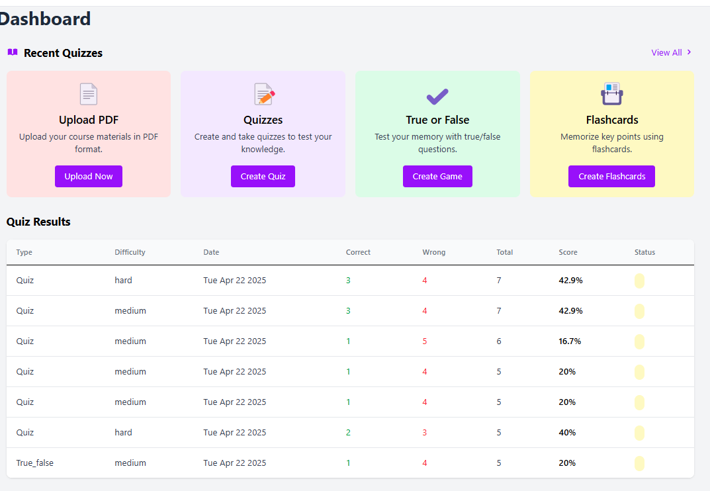

# AI_Powered_Study_Assistant

This is a full-stack web application that converts PDFs into interactive educational content — including quizzes, true/false questions, and flashcards — using AI. It also tracks user performance and supports user authentication.

---

## Features

-  Upload PDF files or input URLs
-  Generate:
  - Multiple choice quizzes
  - True/False questions
  - Flashcards
-  Store and view user performance and quiz results
-  JWT-based user authentication (signup/login)
-  Dashboard to review generated content and past scores

---
# Technologies Used

- **Frontend**: React + Redux + TailwindCSS
- **Backend**: Node.js + Express + MongoDB (Mongoose)
- **AI Engine**: Flask + Google Generative AI
- **Authentication**: JWT + bcrypt
- **PDF Upload & Parsing**: Multer + pdf-parse

##  Tech Stack

### Frontend
- React.js + Tailwind CSS
- Redux Toolkit (state management)
- React Router DOM

### Backend
- Node.js (Express.js for Auth and Results API)
- Python Flask (AI processing with Google Generative AI)
- MongoDB (Mongoose for data models)

## Project Preview
![Homepage]
![Quiz UI]
![Dashboard]

##  How to Run the Project

###  Frontend (React)

## Navigate to the frontend directory:
   cd frontend
   npm install
   npm run dev
   
##  Backend (Express.js)

## Navigate to the backend directory:
  cd backend
  npm install
  nodemon index.js
  
## AI Mode (Python Flask Service)
    python -m venv venv
    venv\Scripts\activate (On Windows)
    python aimode.py

  

